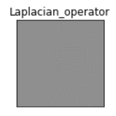

# Edge-Detection
## Aim:
To perform edge detection using Sobel, Laplacian, and Canny edge detectors.

## Software Required:
Anaconda - Python 3.7

## Algorithm:
### Step1:
Import the required packages.

### Step2:
Read the image and cconvert into gray image.

### Step3:
Remove the noise of the image using gaussian operator.

### Step4:
Find the sobel edge,laplacian edge,canny edge using the built in modules available in opencv.

### Step5:
Plot the edged image using matplotlib.

## Program:

``` Python
# Import the packages
import cv2
import matplotlib.pyplot as plt

# Load the image, Convert to grayscale and remove noise
ip_img=cv2.imread("Rick.jpg")
gray_img=cv2.cvtColor(ip_img,cv2.COLOR_BGR2GRAY)
cv2.imshow("Gray image",gray_img)
img=cv2.GaussianBlur(gray_img,(3,3),0)

# SOBEL EDGE DETECTOR
sobelx = cv2.Sobel(img,cv2.CV_64F,1,0,ksize=5)
sobely = cv2.Sobel(img,cv2.CV_64F,0,1,ksize=5)
sobelxy = cv2.Sobel(img,cv2.CV_64F,1,1,ksize=5)

plt.figure(1)
plt.subplot(2,2,1),plt.imshow(img,cmap = 'gray')
plt.title('Original'), plt.xticks([]), plt.yticks([])
plt.show()

plt.figure(1)
plt.subplot(2,2,1),plt.imshow(sobelx,cmap = 'gray')
plt.title('Sobelx'), plt.xticks([]), plt.yticks([])
plt.show()

plt.figure(1)
plt.subplot(2,2,1),plt.imshow(sobely,cmap = 'gray')
plt.title('Sobely'), plt.xticks([]), plt.yticks([])
plt.show()

plt.figure(1)
plt.subplot(2,2,1),plt.imshow(sobelxy,cmap = 'gray')
plt.title('Sobelxy'), plt.xticks([]), plt.yticks([])
plt.show()

# LAPLACIAN EDGE DETECTOR
laplacian = cv2.Laplacian(img,cv2.CV_64F)
plt.figure(1)
plt.subplot(2,2,1),plt.imshow(laplacian,cmap = 'gray')
plt.title('Laplacian_operator'), plt.xticks([]), plt.yticks([])
plt.show()

# CANNY EDGE DETECTOR
canny_edges = cv2.Canny(img, 120, 150)
plt.figure(1)
plt.subplot(2,2,1),plt.imshow(canny_edges,cmap = 'gray')
plt.title('Canny_operator'), plt.xticks([]), plt.yticks([])
plt.show()
```
## Output:
### SOBEL EDGE DETECTOR

<br>

### LAPLACIAN EDGE DETECTOR

<br>


### CANNY EDGE DETECTOR

<br>

## Result:
Thus the edges are detected using Sobel, Laplacian, and Canny edge detectors.
